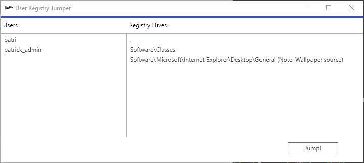

# User Registry Jumper

The User Registry Jumper is a tool (based on C#) to jump into specific user registry hives.



## Requirements

* Windows-based system
* .NET Framework 4.7.2

## Usage

The executable (UserRegistryJumper.exe) is GUI-based tool. The second part is a textfile (registryhives.txt) which have to be in the same directory like the executable.
The textfile contains the bookmarks in the following format:

```
.
Software\Classes
Software\Microsoft\Internet Explorer\Desktop\General (Note: Wallpaper source)
```

The "." bookmark is a special one which points directly to the root of the selected user.  
It is possible to add notes to the bookmarks. The important syntax is to write your note into ( ).

## Troubleshooting

I tried to write useful error messages. I used the `Debug.WriteLine` which implements OutputDebugString.  
[Debug View](https://docs.microsoft.com/en-us/sysinternals/downloads/debugview) is a very good tool to read these messages.

## Issues / Question / Suggestions for improvement

Please create an issue. I'll love to hear feedback.